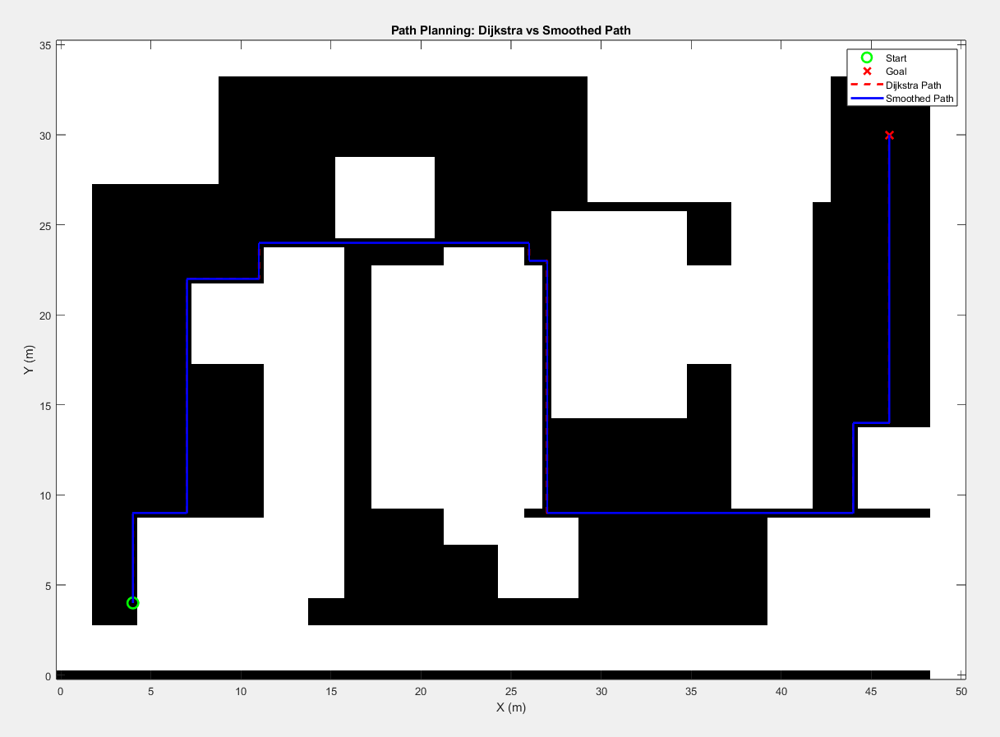

# Drone Path Planning and Control with NMPC + Dijkstra

This repository demonstrates drone navigation in obstacle environments using:

Path Planning → Dijkstra’s Algorithm + Path Smoothing

Controller → Nonlinear Model Predictive Control (NMPC) with Multiple Shooting

Goal → Ensure safe obstacle avoidance and dynamically feasible trajectory tracking

All result images are stored in the img/ folder and automatically displayed below.

## Simulation Results

### 1. Path Planning: Dijkstra vs Smoothed Path

Explanation:

Black Regions → Obstacles

White Regions → Free space

Green Circle → Start point

Red Cross → Goal point

Red Dashed Line → Raw Dijkstra path (shortest grid-based path, but sharp turns)

Blue Line → Smoothed path (removes sharp corners → feasible for drones)

Insight: The smoothed path balances shortest distance and drone dynamics feasibility. Raw Dijkstra is often too jerky for real UAVs.

### 2. Acceleration Profile After Time Scaling

Explanation:

Y-axis = Acceleration (m/s²)

X-axis = Time (s)

The spikes show when the drone executes sharp turns or corrections.

Most of the time, acceleration stays low → indicating efficient motion.

Insight: Sudden high peaks correspond to nonlinear corrections at corners. NMPC ensures stability even during aggressive maneuvers.

### 3. Speed Profile After Time Scaling

Explanation:

Y-axis = Speed (m/s)

X-axis = Time (s)

Drone speed hovers near 3 m/s (limit set in NMPC constraints).

Speed drops happen during tight turns or obstacle avoidance.

Insight: NMPC respects velocity constraints while adapting speed at challenging sections. This keeps the drone safe & dynamically consistent.

### 4. Position Tracking, Motor Thrusts, and Orientation

Top Row: Position Tracking

X Position → Drone follows the reference almost perfectly.

Y Position → Matches the reference with minor deviations at corners.

Z Position → Maintains altitude (≈2m) with very stable tracking.

Bottom Left: Motor Thrusts

Each of the 4 motors responds dynamically.

Spikes appear during sharp turns or trajectory corrections.

Shows NMPC distributing forces effectively to stabilize the drone.

Bottom Right: Orientation

Roll (φ), Pitch (θ), Yaw (ψ) plotted over time.

Rapid changes during turns, but always recover smoothly.

Confirms NMPC stabilizes attitude control even under nonlinear motion.

Insight: This figure proves NMPC provides tight trajectory tracking while managing motor forces and attitude stability.

### 5. 3D Trajectory Tracking

Explanation:

Blue Line → Actual trajectory flown by the drone

Red Dashed Line → Reference (smoothed Dijkstra path)

The two lines nearly overlap → showing excellent tracking accuracy.
Only slight deviations occur at tight obstacle corners, but the drone quickly corrects.

Insight: NMPC ensures 3D path feasibility, combining planning (Dijkstra + smoothing) with control (multiple shooting NMPC).

## Key Features

Path Planner: Dijkstra + smoothing for obstacle-aware feasible paths

Controller: NMPC with multiple shooting for nonlinear dynamics

Performance: Stable position, speed, and orientation control

Outputs: Path planning map, acceleration/speed profiles, tracking vs reference, motor thrusts, and 3D trajectory
## Authors

- [@iwinardhyas](https://www.github.com/iwinardhyas)

erwin.ardias@gmail.com
